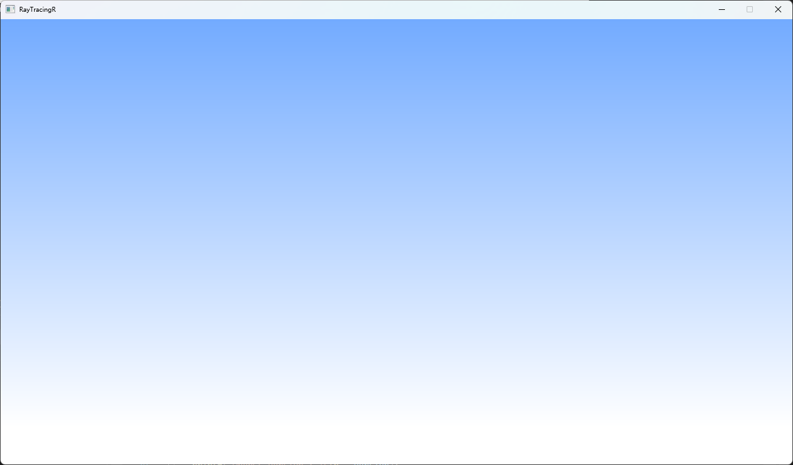

# Ray-Tracing-Rendering-in-Many-Weekends

学习中。。。

跟着 [Ray Tracing in One Weekend](https://raytracing.github.io/books/RayTracingInOneWeekend.html) 学习光线追踪。

### v0.1

**Session 1. Overview**

**Session 2. Output an Image**

原书中使用输出单张图片的方式保存渲染结果，这里我们使用OpenGL纹理（将渲染结果保存到一个窗口大小的纹理并渲染一个窗口大小的矩形）以获得更好的交互。OpenGL的学习使用可参考 [LearnOpenGL](https://learnopengl-cn.github.io/01 Getting started/01 OpenGL/) 或本人之前的一个项目 [Real-Time-Rendering-with-OpenGL](https://github.com/CarrOvOt/Real-Time-Rendering-with-OpenGL) 。

**Session 3. The vec3 Class**

原书自己实现了一些向量的计算，我们直接使用三方库GLM。

**Session 4. Rays, a Simple Camera, and Background**

这里在之前项目的 Camera 类的基础上完成。

 

参考资料：

[jogl - Efficient way of updating texture in OpenGL - Stack Overflow](https://stackoverflow.com/questions/21577964/efficient-way-of-updating-texture-in-opengl)

[OpenGL第九节：操作像素点去更新纹理_mb62806e3395bd5的技术博客_51CTO博客](https://blog.51cto.com/u_15639793/5297415)
